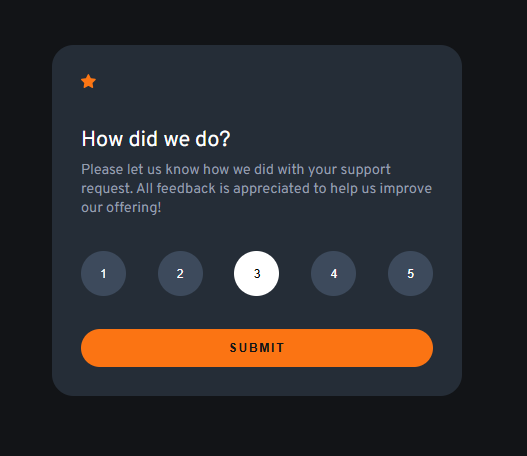
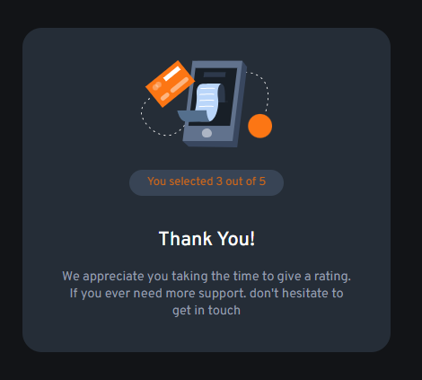

# Frontend Mentor - Interactive rating component solution

This is a solution to the [Interactive rating component challenge on Frontend Mentor](https://www.frontendmentor.io/challenges/interactive-rating-component-koxpeBUmI). 
## Table of contents

- [Overview](#overview)
  - [The challenge](#the-challenge)
  - [Screenshot](#screenshot)
  - [Links](#links)
- [My process](#my-process)
  - [Built with](#built-with)
  - [What I learned](#what-i-learned)
- [Author](#author)

## Overview

### The challenge

An interactive rating component where user can select any one rating. After clicking submit button, the app shows the selected rating along with a Thankyou message. The interface is user friendly and interactive.

### Screenshot

### Links

- Solution URL: [Solution URL](https://github.com/ayeshalatif1/interactiveRatingComponent)
- Live Site URL: [Live Site URL](https://your-live-site-url.com)

## My process

### Built with

- Semantic HTML5 markup
- CSS custom properties
- Flexbox
- Responsive Layout
- React

### What I learned

--How to define and manage multiple routes in a React application using React Router

--How to use the useNavigate hook to programmatically navigate between pages for a smooth user experience

--How to use React state to store and update dynamic values (such as user ratings)

--How to pass data between different routes/components using navigation state

## Author

- Frontend Mentor - [@ayeshalatif1](https://www.frontendmentor.io/profile/ayeshalatif1)

